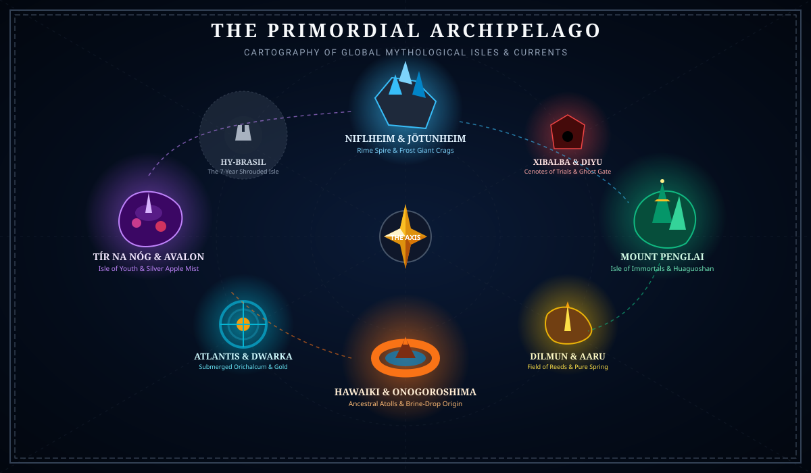

# The World: Compendium of Mythological Islands & Relics

> *"The ocean does not end, because imagination has no horizon. Every pantheon that mortals ever prayed to, whispered about around fires, or etched into stone is out there, anchored to an island in the deep."*

---



---

## Executive Overview

**The World** is organized around a foundational premise: **we do not invent arbitrary fantasy tropes when humanity has spent five thousand years forging the greatest mythologies on Earth.**

Every landmass that rises from the endless ocean, every weapon that can be drawn from a stone, and every tool that navigates the waters is drawn directly from authentic world folklore, epics, and religious traditions:
- **Norse** (*Poetic & Prose Edda*)
- **Chinese** (*Shan Hai Jing*, *Journey to the West*, Taoist cosmology)
- **Greek & Hellenic** (*Homer*, *Hesiod*, *Plato*)
- **Celtic & Arthurian** (*Lebor Gabála Érenn*, *Mabinogion*, *Immrama*)
- **Vedic & Hindu** (*Mahabharata*, *Ramayana*, *Rigveda*)
- **Egyptian** (*Book of the Dead*, Pyramid Texts)
- **Mesopotamian** (*Epic of Gilgamesh*, Enuma Elish)
- **Polynesian & Māori** (*Māui cycle*, *Hawaiki traditions*)
- **Japanese / Shinto** (*Kojiki*, *Nihon Shoki*)
- **Yoruba & West African** (*Ifá corpus*, Orisha lore)
- **Mesoamerican** (*Popol Vuh*, Aztec Codex Florentino)

---

## Documentation Index

### 🏝️ 1. The Archipelago: Islands & Realms
Detailed specifications of individual islands, their mythological source texts, environmental mechanics, local dangers, and flora/fauna.

- **[Archipelago Overview & System Mechanics](./islands/README.md)** — Ocean currents, zonal physics, ley lines, and travel rules.
- **[Archipelago Overview & System Mechanics](./islands/README.md)** — Ocean currents, zonal physics, ley lines, and travel rules.
- **[01. Huaguoshan & The Jade Peaks](./islands/01-penglai-huaguoshan.md)** *(Chinese / Journey to the West)* — Havoc in Heaven, Sun Wukong's Water Curtain Cave, and the Eight Trigrams Crucible.
- **[02. The Labyrinth of Minos](./islands/02-labyrinth-of-minos.md)** *(Greek / Crete)* — Daedalus' shifting subterranean maze, Asterion the Minotaur, and the bronze colossus Talos.
- **[03. The Plain of Vigrid & The World Forge](./islands/03-vigrid-ragnarok.md)** *(Norse / Ragnarök)* — The apocalyptic battlefield, Surtr's flaming sword, broken Gleipnir chains, and the shattered Bifröst.
- **[04. The Golden Citadel of Lanka](./islands/04-lanka-ramayana.md)** *(Vedic / Ramayana)* — Ravana's gold megacity, the floating stone bridge of Rama, and high-altitude Vimana hangars.
- **[05. The Sacred Cedar Forest & Uruk](./islands/05-cedar-forest-gilgamesh.md)** *(Mesopotamian / Epic of Gilgamesh)* — Sacred titan cedars, the acoustic roars of Humbaba, and the deep-sea rejuvenation weed.
- **[06. The Necropolis of the 12 Gates](./islands/06-necropolis-duat.md)** *(Egyptian / Book of the Dead)* — Darkness survival, the Scales of Ma'at judgment, and the nightly Solar Barque escort.
- **[07. The City of the Five Suns](./islands/07-five-suns-aztec.md)** *(Aztec / Five Cosmic Eras)* — Stepped teocalli pyramids, solar eclipse raids by Star Demons, and obsidian weapons.
- **[08. The Taiga of the Dancing Hut](./islands/08-taiga-baba-yaga.md)** *(Slavic / Russian Skazki)* — Baba Yaga's walking fowl-legged cabin, Koschei's hidden needle phylactery, and the Firebird.
- **[09. The Sky Path of the Wild Hunt](./islands/09-the-wild-hunt.md)** *(European Folklore)* — Spectral cloud highway, ghostly hunting horn, and the hunt-or-be-hunted mechanic.
- **[10. The Concentric Rings of Atlantis](./islands/10-atlantis-dwarka.md)** *(Platonic Greek)* — Submerged orichalcum canals, hydraulic pressure locks, and deep-sea exploration.
- **[11. Tír na nÓg & Avalon](./islands/11-tir-na-nog-avalon.md)** *(Celtic / Arthurian)* — Time dilation, silver mist curtains, golden apple orchards, and sovereign plague healing.
- **[12. Niflheim & Jötunheim](./islands/12-niflheim-jotunheim.md)** *(Norse)* — Primordial rime frostbite, eleven venomous rivers, and the gnawed root of Yggdrasil.
- **[13. Dilmun & Aaru](./islands/13-dilmun-aaru.md)** *(Sumerian & Egyptian)* — Absolute non-aggression truce sanctuary, sweetwater springs of Enki, and golden barley fields.
- **[14. Hawaiki & Onogoroshima](./islands/14-hawaiki-onogoroshima.md)** *(Polynesian & Shinto)* — Celestial star-wayfinding without HUD mini-maps, living volcanic vents, and brine-spear reefs.
- **[15. Xibalba & Diyu](./islands/15-xibalba-diyu.md)** *(Mayan & Chinese Underworld)* — Subterranean cenotes, the six trial houses of the Popol Vuh, and soul-state revival ballgames.
- **[16. Hy-Brasil & Anthemoessa](./islands/16-hy-brasil-anthemoessa.md)** *(Irish Folklore & Greek Siren Seas)* — The 7-year phase-shifting phantom island and auditory siren lures.

---

### ⚔️ 2. The Reliquary: Special Tools & Weapons
Mechanics and lore for authentic legendary arms, navigation tools, and divine wearables.

- **[Reliquary System: Attunement & Divine Burden](./tools-and-weapons/README.md)** — How mythic relics operate, worthiness checks, divine backlash, and item degradation rules.
- **[01. Divine Weapons](./tools-and-weapons/01-divine-weapons.md)** — Ruyi Jingu Bang (Sun Wukong's Cudgel), Mjölnir, Trishula, Gáe Bulg, Kusanagi-no-Tsurugi, Xiuhcoatl, Harpe of Kronos, Oshe Shango.
- **[02. Sacred Tools & Implements](./tools-and-weapons/02-sacred-tools.md)** — Manaiakalani (Māui's fishhook), Amenonuhoko (Jeweled Spear compass), Skíðblaðnir (folding ship), Iron Fan (Bashōsen), Cauldron of the Dagda, Sekhem Scepter.
- **[03. Relics, Regalia & Wearables](./tools-and-weapons/03-relics-and-regalia.md)** — Talaria of Hermes (winged sandals), Aegis of Athena, Cap of Hades (Helm of Invisibility), Draupnir (gold-dripping ring), Oshun's Brass Mirror, Brísingamen.

---

## Comparative Matrix: Realms & Their Signatures

| Island / Realm | Mythology | Core Environmental Rule | Signature Weapon / Tool | Primary Hazard / Trial |
|---|---|---|---|---|
| **Mount Penglai** | Chinese / Taoist | **Altered Gravity** (Low gravity on peaks; cloud-walking) | *Ruyi Jingu Bang* & *Bashōsen* | Dragon King's Abyssal Whirlpool |
| **Tír na nÓg & Avalon** | Celtic / Irish | **Temporal Dilation** (1 hour = 1 week; eternal youth aura) | *Cauldron of the Dagda* & *Fragarach* | The Féth Fíada (Memory-stealing silver mist) |
| **Atlantis & Dwarka** | Platonic & Vedic | **Hydraulic Pressure** (Submerged biome, orichalcum conduits) | *Trishula* & *Poseidon's Trident* | Giant Kraken & Subsea Pressure Cascades |
| **Niflheim & Jötunheim** | Norse | **Rime Frostbite** (Slowing hypothermia, brittle materials) | *Mjölnir* & *Gungnir* | Jörmungandr roaming tidal waves & Jötnar |
| **Dilmun & Aaru** | Sumerian & Egyptian | **Divine Truce** (No weapons may be unholstered; pure healing) | *Sekhem Scepter* & *Was-Scepter* | Weighing of the Heart at the 12 Gates |
| **Hawaiki & Onogoro** | Polynesian & Shinto | **Dynamic Wayfinding** (No mini-map; navigate by stars/swells) | *Manaiakalani* & *Amenonuhoko* | Boiling geyser reefs & Volcanic Pele vents |
| **Xibalba & Diyu** | Mayan & Chinese | **Purgatorial Passage** (Ghost-state exploration after death) | *Xiuhcoatl* & *Meng Po's Ladle* | The 6 Houses of Trial (Cold, Bats, Blades) |
| **Hy-Brasil** | European / Celtic | **Phase-Shift Cycle** (Only solid during full moon tides) | *Skíðblaðnir* & *Mirror of Oshun* | Siren songs & Hallucinatory illusions |

---

## Visual Concept Gallery

```
docs/assets/visuals/
├── world-archipelago-map.svg      <- Master navigation chart & island locations
├── island-penglai.svg             <- Mount Penglai floating karst & pagoda concept
├── island-atlantis.svg            <- Atlantis & Dwarka concentric submerged citadels
├── weapon-ruyi-jingu-bang.svg     <- Sun Wukong's As-You-Will Gold-Banded Cudgel
├── weapon-mjolnir.svg             <- Thor's Thunder Hammer with Urnes knotwork
├── weapon-gae-bulg.svg            <- Cú Chulainn's barbed 30-spur sea monster spear
├── tool-manaiakalani.svg          <- Māui's island-pulling celestial bone fishhook
└── tool-talaria.svg               <- Hermes' golden winged wave-striding sandals
```

---

## Integration with Existing Prototype

The Three.js prototype in `src/` currently features a flat ground plane, procedural character animations, and toggleable Run/Jump/Flight abilities. These documentation files provide the direct design blueprint for:
1. **`src/world/Environment.ts`** — Extending gravity and ground-height per island zone (e.g. low-gravity Penglai, heavy-pressure Atlantis).
2. **`src/character/abilities/`** — Translating mythic relics directly into ability classes (e.g., `Talaria` for sprint/flight, `Manaiakalani` for grappling hooks, `Mjolnir` for recall attacks).
3. **`src/world/Props.ts`** — Generating biome-specific architecture (Taoist pagodas, Norse rime pillars, concentric circular canals).
