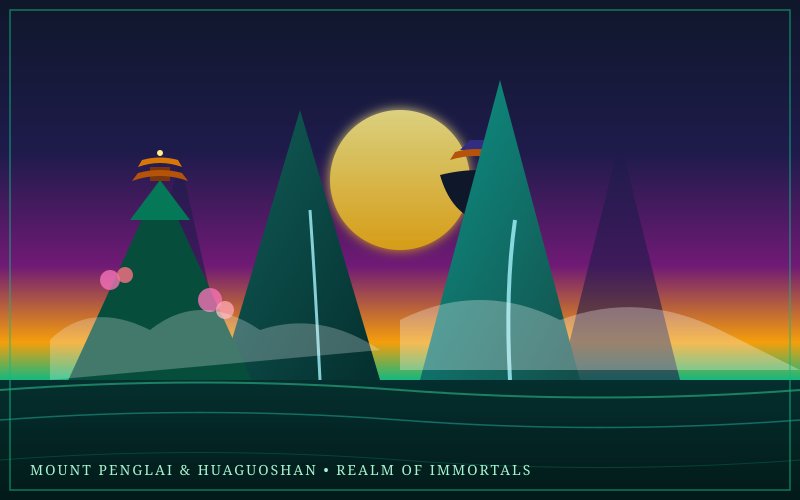

# Island Spec: Mount Penglai & Flower-Fruit Mountain (Huaguoshan)

> *"In the Bohai Sea rise five sacred islands, anchored on the shells of colossal sea turtles so they do not drift into the void. Upon Penglai, the palaces are fashioned of platinum and gold, and trees of jade bear fruit that cures mortal decay."*  
> — *Liezi (列子) & Classic of Mountains and Seas (山海經)*

---



---

## 1. Mythological Provenance

- **Traditions:** Chinese Taoist Mythology, *Journey to the West* (西遊記), *Shan Hai Jing* (山海經), *Liezi*.
- **Historical Archetype:** The legendary paradise island of the Eight Immortals (*Baxian*) and the ancestral birthplace of the Stone Monkey King, Sun Wukong (*Huaguoshan* / Flower-Fruit Mountain).
- **Cosmological Foundation:** In ancient Chinese cosmology, Penglai (蓬萊) is one of five sacred islands (along with Fangzhang, Yingzhou, Daiyu, and Yuanjiao) located in the Eastern Ocean. The islands floated freely until the celestial Emperor commanded fifteen giant sea turtles (*Ao*) to anchor them on their shells.

---

## 2. Geography & Biomes

```
               [ Upper Stratum: Floating Jade Karsts ]
                  Pavilion of the Eight Immortals
                    Peaches of Immortality Orchard
                                 ▲
                                 │ Cloud Stairs & Thermal Qi
                                 ▼
               [ Mid Stratum: Huaguoshan Cloud Forest ]
                 Water Curtain Cave (Shuilian Dong)
                 Gibbon Bamboo Groves & Peach Springs
                                 ▲
                                 │ Cascading Waterfalls
                                 ▼
               [ Lower Stratum: The Coral Shore & Trench ]
                   Tide-Receding Turtle Shallows
                 Descent into Dragon King's Palace
```

### Key Sub-Zones

1. **The Floating Jade Karsts (Penglai Pinnacle):** Towering limestone pillars that levitate into the clouds, tethered only by ancient braided silk ropes and magnetic Qi ley lines. Pagodas perched on crags house Taoist alchemical furnaces.
2. **The Pantao Orchard (The Immortality Grove):** An orchard of divine peach trees that blossom once every three thousand years. Eating their blossoms temporarily grants immortality buffs (death prevention charges).
3. **The Water Curtain Cave (Shuilian Dong):** A roaring 100-meter waterfall concealing a sprawling cave city lit by phosphorescent moss, stone thrones, iron bridges, and weapon racks carved from stalagmites.
4. **The Trench of the Dragon King (Donghai Longgong Edge):** Off the eastern shoreline, the seabed plunges into an abyssal underwater trench leading to the crystal palaces of Ao Guang, Dragon King of the Eastern Sea.

---

## 3. Zonal Physics & Environmental Rules

- **Reduced Gravity (-40%):** Players jump significantly higher, fall with feather-fall deceleration, and can dash between floating mountain stones.
- **Qi Cloud Traversal:** Clouds around the upper peaks are solid enough to run upon for characters with high agility or wind-aligned relics.
- **Eternal Verdancy:** Plants, wood, and organic materials cannot rot or degrade on the island. Any negative poison debuff decays at triple speed.

---

## 4. Inhabitants & Factions

- **The Taoist Immortals (Baxian):** NPC mentors who brew legendary elixirs, teach shape-shifting arts, and challenge arrogant players to riddle duels.
- **The Monkey Tribes of Huaguoshan:** Agile simian warriors armed with quarterstaffs who guard the cave approaches. They mimic player gestures and can be befriended using fruit offerings.
- **The Ao (Titan Turtles):** Massive sea turtles swimming slowly around the island base. Their carapaces feature harvestable deposits of pure jade and cinnabar.
- **Sea Yakshas & Dragon Patrols:** Patrol the surrounding waters, demanding tribute for crossing into the Eastern Ocean.

---

## 5. Signature Relics & Local Loot

- **[Ruyi Jingu Bang (如意金箍棒)](../tools-and-weapons/01-divine-weapons.md#1-ruyi-jingu-bang)**: Sun Wukong's gold-banded cudgel, originally resting in the Dragon King's treasury as a seabed stabilizer.
- **[The Iron Palm-Leaf Fan (Bashōsen)](../tools-and-weapons/02-sacred-tools.md#4-the-iron-fan-of-princess-iron-fan)**: Capable of extinguishing raging fires, parting storms, and creating vertical gale geysers.
- **Cinnabar Immortality Elixir:** Restores all health and provides 10 minutes of immunity to all regional world plagues.

---

## 6. Implementation Notes for Three.js & Engine

- **Terrain Shader:** Stylized karst limestone with vertical green gradient textures and moss cap vertex painting.
- **Water Shaders:** Dual-layer water system: top surface has turquoise translucency, while waterfalls cascading off floating islands fade into volumetric mist particles using Three.js `PointsMaterial`.
- **Soundscape:** Distant guqin string melodies, gibbon calls across the valleys, rushing waterfall cascades, and wind chimes.
