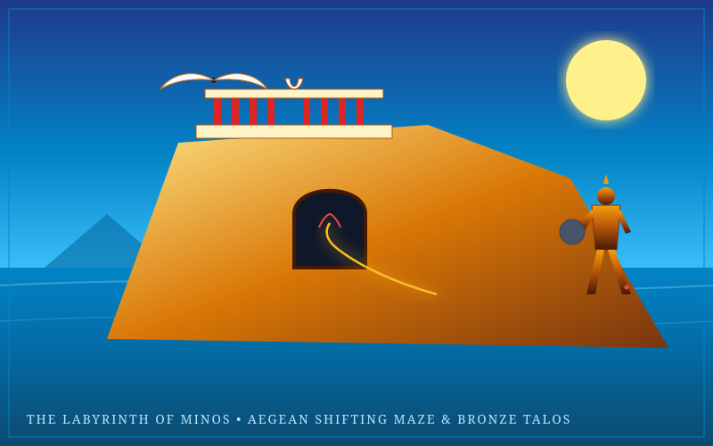

# Island Spec: The Labyrinth of Minos & The Bronze Giant

> *"Daedalus, an architect of world renown, constructed the work; he confused the passages and led the eye astray into a labyrinth of errors by a multiplicity of winding ways... So Daedalus made the countless pathways of deception; even he could scarcely find the threshold again, so deceptive was the house he built."*  
> — *Ovid, Metamorphoses (Book VIII, 8 CE)*

---



---

## 1. Mythological Provenance

- **Traditions:** Classical Greek Mythology (*The Myth of Theseus*, *Daedalus and Icarus*, *The Argonautica*).
- **Thematic Core:** The hubris of King Minos, the mechanical genius of Daedalus, the subterranean terror of the Asterion (the Minotaur), the thread of Ariadne, and the coastal patrol of the colossal bronze automaton **Talos**.
- **Adaptation into an Island:** The island is bathed in radiant Mediterranean sunlight on the surface, crowned by the terracotta Minoan palace of Knossos. Beneath its limestone foundations lies the **Procedural Megastructure**: an ever-shifting subterranean labyrinth where the walls rearrange themselves according to clockwork waterwheels.

---

## 2. Geography & Biomes

```
                   [ The Upper Tier: Sunlit Palace of Knossos ]
                    Terracotta Courtyards & Minoan Bull-Horn Altars
                    Clifftop Workshop of Daedalus (Glider Launch)
                                 ▲
                                 │ Bronze Cyclopean Archways
                                 ▼
                   [ The Subterranean Labyrinth (Procedural Maze) ]
                    The Hall of Blind Turns & Echo Chamber
                    The Chamber of Asterion (Minotaur Arena)
                                 ▲
                                 │ Deep Limestone Catacombs
                                 ▼
                   [ The Coastal Shoals & Sea Ramparts ]
                    Patrol Route of the Bronze Colossus Talos
                    White Limestone Sea Stacks & Siren Reefs
```

### Key Sub-Zones

1. **The Sunlit Palace of Knossos:** A breathtaking palatial complex with red-tapered columns, vivid frescoes of acrobats leaping over charging bulls, and oil-storage amphora vaults. Serves as a neutral social trading hub on the surface.
2. **The Daedalian Workshop:** Perched high on the western sea cliffs. Here, players can assemble wax-and-feather glider wings (*Wings of Daedalus*) to catch sea updrafts and fly between islands.
3. **The Shifting Labyrinth (Subterranean Dungeon):** A multi-level dungeon where corridors slide and rotate on heavy stone gears every 15 minutes. Torches burn low; players must track their path using chalk marks or Ariadne's Golden Thread to avoid becoming hopelessly lost.
4. **The Coastal Patrol of Talos:** The bronze colossus circles the island's perimeter three times a day, hurling massive boulders at hostile invading ships and superheating its own metallic body to crush intruders in blazing melee combat.

---

## 3. Zonal Physics & Environmental Rules

- **Spatial Shifting (Dynamic Geometry):** Every 15 minutes, a deep grinding tremor shakes the labyrinth as interior gates seal and corridors rotate, opening new shortcuts while trapping careless wanderers.
- **Auditory Tracking & Echoes:** Sound travels four times further inside the stone labyrinth. Sprinting or clanking in heavy armor attracts the Minotaur from several corridors away, requiring stealth and padded boots.
- **Solar Thermal Gliding:** Rising thermal updrafts off the sunbaked limestone cliffs grant 200% lift velocity to gliders and winged relics.

---

## 4. Inhabitants & Factions

- **Asterion (The Minotaur):** The roaming world boss of the subterranean labyrinth. Wields a colossal double-bladed labrys axe; his charge can break down stone walls.
- **Talos (The Bronze Automaton):** A divine mechanical giant created by Hephaestus. Has an impenetrable bronze body with a single fatal vulnerability: a bronze nail in his right ankle containing the flowing divine ichor that powers his core.
- **The Artificers of Daedalus:** NPC engineers who teach glider flight mechanics, clockwork puzzle design, and lockpicking.
- **Ariadne’s Cult of the Thread:** Mysterious priestesses who weave enchanted golden filaments that glow in total darkness.

---

## 5. Signature Relics & Local Loot

- **Ariadne's Golden Spool (Mitos):** A magical glowing thread that unreels behind the player, leaving a radiant navigational trail visible only to party members and immune to maze-shifting.
- **The Labrys of Minos:** A massive double-headed bronze battleaxe that deals double damage to architectural structures, barriers, and stone automatons.
- **Wings of Daedalus:** Glider wings fashioned from bird feathers and beeswax. Enables long-distance oceanic flight, but melts and fails if flown too close to volcanic islands or high solar altitudes.
- **Vial of Talos' Ichor:** A glowing golden liquid harvested from the bronze giant's heel, used as an alchemical fuel for mechanical vehicles and high-tier automatons.

---

## 6. Implementation Notes for Three.js & Engine

- **Visual Tone:** Contrast between radiant Aegean blue/terracotta gold on the surface and claustrophobic torch-lit limestone corridors below.
- **Shader FX:** Heat shimmer distortion rising from limestone cliffs; glowing red emissive seams on Talos' joints when he overheats.
- **Audio:** Distant bull bellows echoing through stone tunnels, the rhythmic mechanical clanking of water-driven labyrinth gears, and the thundering coastal footsteps of Talos.
