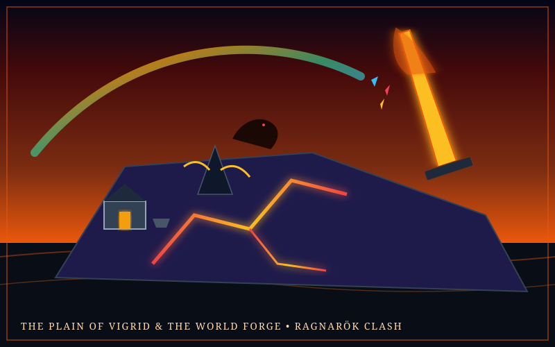

# Island Spec: The Plain of Vigrid & The World Forge

> *"Vigrid is the name of the plain where Surt and the sweet gods shall clash; a hundred leagues wide it measures each way, and such is their destined field."*  
> — *Vafþrúðnismál (Poetic Edda)*

---



---

## 1. Mythological Provenance

- **Traditions:** Old Norse Mythology (*Völuspá*, *Gylfaginning*, *Poetic Edda*).
- **Thematic Core:** The apocalyptic prophecy of **Ragnarök** (The Twilight of the Gods). The shattering of the rainbow bridge Bifröst, the snapping of the impossible fetter *Gleipnir* that bound the wolf Fenrir, the advance of the fire giant Surtr carrying a sword that burns brighter than the sun, and the dwarven smiths of Svartálfaheimr laboring in subterranean magma forges.
- **Adaptation into an Island:** In the endless ocean, Vigrid is a vast, volcanic-and-rime scarred battlefield island. Steam roars continuously where glacial rivers from Niflheim pour into boiling magma rifts from Muspelheim. High above in the clouds, the fractured crystal fragments of the Bifröst bridge hover like a shattered prism arch.

---

## 2. Geography & Biomes

```
                   [ The Shattered Bifröst Sky-Arch ]
                    Prism Crystal Shards & Cloud Footholds
                    The Watchtower of Heimdall (Himinbjörg)
                                 ▲
                                 │ Updraft Thermal Plumes
                                 ▼
                   [ The Plain of Vigrid (The 100-League Field) ]
                    The Broken Monolith of Fenrir (Snapt Gleipnir)
                    The Sword Trench of Surtr (Lævateinn Magma)
                                 ▲
                                 │ Basalt Lava Cataracts
                                 ▼
                   [ The World Forge of the Sons of Ivaldi ]
                    Subterranean Magma Crucibles & Adamant Anvils
                    The Boiling Iron Shore & Drakkar Pier
```

### Key Sub-Zones

1. **The Plain of Vigrid (The War Ground):** A colossal flat expanse of crushed black volcanic basalt and ash. Factions clash here in large-scale server-wide open warfare. Giant skeletal remains of titans and ancient shields litter the terrain.
2. **The Shattered Monolith of Fenrir:** The ancient jagged stone where the wolf was bound until the end of days. Strands of the silky golden ribbon *Gleipnir* (woven from the sound of a cat's footfall, the beard of a woman, the roots of a mountain, the sinews of a bear, the breath of a fish, and the spittle of a bird) still cling to the rock, radiating anti-binding dispelling magic.
3. **The Sword-Trench of Surtr:** A massive fissure cleaving the eastern half of the island where the fire giant's blade strikes the earth, exposing liquid core heat that ignites non-magical wooden gear.
4. **The Dwarven World Forge (The Crucible of Brokkr & Sindri):** Located in subterranean lava tubes under the plain. The only location in the world where players can refine raw meteoric star-iron and forge runic masterworks like *Mjölnir*.

---

## 3. Zonal Physics & Environmental Rules

- **Elemental Contrast (Fire vs. Rime):** The island is locked in dynamic thermal conflict. Entering the magma trenches inflicts *Muspel Burn*, while approaching the northern coast inflicts *Niflheim Freeze*. Players must balance thermal gear or stay in the tempered central battlefield.
- **Runic Weapon Amplification:** Weapons engraved with Elder Futhark runes gain +40% elemental surge damage while on the island.
- **The Bifröst Low-Gravity Shards:** Leaping onto the floating rainbow crystal shards in the upper atmosphere reduces gravity by 60%, allowing acrobatic aerial duels.

---

## 4. Inhabitants & Factions

- **The Einherjar (The Honored Slain):** Spectral golden-armored warriors from Valhalla who spar endlessly across the plain, offering combat training and sparring challenges to worthy mortals.
- **The Sons of Muspel:** Flame-wreathed giant raiders who march from the magma fissures wielding obsidian blades.
- **Brokkr and Sindri:** The master dwarf artisans presiding over the World Forge. They demand rare trophies from world bosses before agreeing to forge or upgrade divine-tier relics.
- **Fenrir (World Boss Manifestation):** An apocalyptic wolf whose lower jaw scrapes the earth and upper jaw touches the clouds when fully unleashed.

---

## 5. Signature Relics & Local Loot

- **Strand of Gleipnir:** A hair-thin golden cord that can be thrown to bind any berserk boss or player, completely locking their movement abilities for 10 seconds regardless of their size.
- **Cinder of Surtr's Blade:** An eternal burning ember used to forge fire-enchanted weapons and illuminate the deepest ocean abysses.
- **Gjallarhorn (Echo Horn of Heimdall):** A sounding horn whose blast can be heard across the entire server, alerting all players across all islands of incoming world events.

---

## 6. Implementation Notes for Three.js & Engine

- **Visual FX:** Dual particle system: falling black volcanic ash in the south and floating snow flurries in the north. The Bifröst arch uses an animated iridescent shader with additive blending.
- **Lava Shader:** Glowing emissive lava with dynamic Voronoi noise pulsing along the surface.
- **Audio:** The rhythmic concussive strikes of a colossal anvil, crackling wildfire, distant thunder, and the haunting resonance of the horn of Heimdall.
