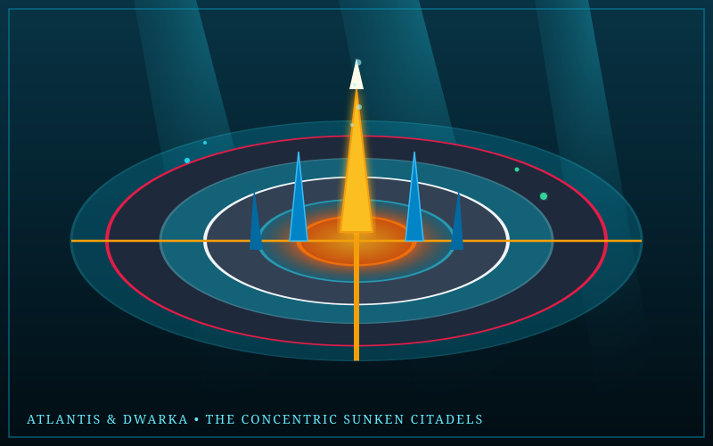

# Island Spec: Atlantis & Sunken Dwarka

> *"There was an island opposite the strait which you call the Pillars of Heracles... larger than Libya and Asia together. In this island of Atlantis there was a great and wonderful empire... But afterwards there occurred violent earthquakes and floods; and in a single day and night of misfortune, the island of Atlantis disappeared into the depths of the sea."*  
> — *Plato, Timaeus & Critias (c. 360 BCE)*

---



---

## 1. Mythological Provenance

- **Traditions:** Classical Greek / Platonic Dialogues (*Timaeus*, *Critias*) & Ancient Hindu Epics (*Mahabharata*, *Harivamsa*, *Srimad Bhagavatam*).
- **Historical Archetype:** The twin sunken wonders of antiquity:
  1. **Atlantis (Ἀτλαντὶς νῆσος):** The advanced maritime city laid out in concentric rings of land and water by Poseidon, covered in glistening orichalcum metal.
  2. **Dwarka (द्वारका):** The golden city constructed by the divine architect Vishwakarma on the coast of Gujarat for Lord Krishna, with 900,000 royal palaces fashioned from crystal, gold, and silver, submerged beneath the Arabian Sea upon Krishna's departure.
- **Cosmological Foundation:** In *The World*, Atlantis and Dwarka form a dual sunken realm: the upper rings break through the ocean surface as fortified coral ramparts, while the grand citadels plunge downward into a breathable deep-sea trench sustained by an ancient orichalcum energy nexus.

---

## 2. Geography & Biomes

```
                   [ The Surface Atoll & Hercules Pillars ]
                    Concentric Coral Ramparts & Lighthouses
                                 ▲
                                 │ Giant Hydraulic Locks & Floodgates
                                 ▼
                   [ The Middle Rings: Orichalcum & Marble ]
                    Poseidon's Temple & Golden Vimana Citadel
                    Canal Networks for Amphibious Submersibles
                                 ▲
                                 │ Deep Pressure Cascade
                                 ▼
                   [ The Abyssal Trench: Trench of Varuna ]
                    Coral Gardens, Leviathan Pens & Kraken Trench
```

### Key Sub-Zones

1. **The Concentric Rings of Poseidon:** Three circular rings of water and two of land. The stone walls are quarried from red, black, and white stone, crowned with plates of copper, tin, and incandescent, glowing **orichalcum** (ὀρείχαλκος).
2. **The Golden Vimanas of Dwarka:** Ornate tiered Dravidian-style gopuram towers made of celestial gold that do not corrode in saltwater. Ancient mechanical flying ships (*Vimanas*) rest in submerged hangars.
3. **The Clepsydra Hydraulic Aqueducts:** Colossal stone aqueducts and siphon towers that draw ocean currents, generating hydrothermal power and maintaining breathable air pockets across submerged residential wards.
4. **The Trench of Varuna:** The abyssal ocean floor surrounding the citadel, patrolled by giant sea serpent Makaras, giant mantas, and the legendary Kraken.

---

## 3. Zonal Physics & Environmental Rules

- **Hydraulic Pressure Fields:** In the dry, air-domed districts, normal physics apply. In the submerged canal sectors, dynamic buoyancy and 3D swimming mechanics activate, with specialized hydrodynamic currents that accelerate player movement.
- **Orichalcum Energy Conductors:** Orichalcum nodes emit localized electromagnetic pulses. Players carrying iron or steel weapons experience magnetic drag, while bronze and gold relics receive heightened damage output.
- **Water Breathing & Pressure Ward:** Characters entering the deeper submerged wards must either possess Poseidon's blessing, equip a Vedic *Varunastra* talisman, or operate submersible vehicles to prevent crushing depth damage.

---

## 4. Inhabitants & Factions

- **The Atlantean Guard (Orichalcum Hoplites):** Elite warriors clad in bronze-orichalcum scale armor, armed with hydro-tridents and repulsor shields.
- **The Automatons of Hephaestus (Talos Constructs):** Giant brass sentinels patrolling the outer seawalls, firing superheated steam jets at unauthorized vessels.
- **The Yadava Remnants:** Ascetic sages and master architects in Dwarka who teach ancient engineering, celestial navigation, and divine metal forging.
- **The Makaras & Abyssal Leviathans:** Massive mythical hybrid sea beasts (part crocodile, part elephant, part serpent) that serve as aquatic steeds or formidable world bosses.

---

## 5. Signature Relics & Local Loot

- **[Poseidon's Trident (Triaina)](../tools-and-weapons/01-divine-weapons.md#3-trishula--poseidons-trident)**: Forged by the Telchines; commands seismic shocks, fractures rock into geysers, and controls oceanic tides.
- **[Sudarshana Chakra (सुदर्शन चक्र)](../tools-and-weapons/01-divine-weapons.md#3-trishula--poseidons-trident)**: The spinning serrated discus of Vishnu with 108 sharp edges, burning with celestial fire and homing in on designated adversaries.
- **Ingots of Pure Orichalcum:** The legendary red-gold metal used to forge corrosion-proof armor, conduit circuits, and energy-storing harpoons.

---

## 6. Implementation Notes for Three.js & Engine

- **Lighting & Shader FX:** Volumetric underwater light shafts (*caustics*) projected from above using custom shader materials. Orichalcum surfaces feature high metallic and roughness maps with a radiant red-orange emissive pulse.
- **Audio Ambience:** Resonant deep-water pressure hums, muffled metallic groans of hydraulic bulkheads, whale songs, and crystalline water-drop echoes.
