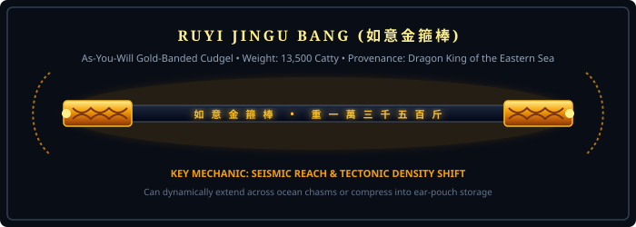
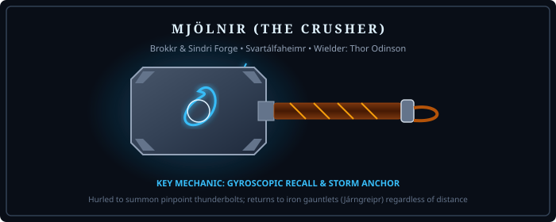
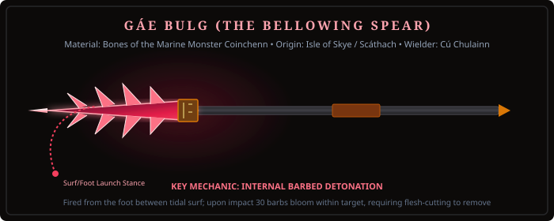

# Reliquary Spec: Divine Weapons (Armaments of the Gods)

> *"The weapon of a god is never a mere piece of sharpened metal; it is an elemental decree made manifest. When swung, it does not simply cut flesh; it alters the grammar of reality."*

---

## 1. Ruyi Jingu Bang (如意金箍棒) — *Chinese / Taoist*

**Title:** The As-You-Will Gold-Banded Cudgel (The Ocean-Measuring Needle)  
**Primary Source:** *Journey to the West* (西遊記), Wu Cheng'en (16th c.)  
**Original Owner:** Yu the Great (used to measure depth during the Great Flood) ➔ Dragon King of the Eastern Sea (Ao Guang) ➔ Sun Wukong  
**Weight:** 13,500 catty (approx. 8,100 kg / 17,850 lbs)

---

---

### Mechanics & Gameplay Features
- **Dynamic Size & Reach Expansion:**
  - *Standard Form:* 2-meter dual-handed combat staff. Fast fluid martial combos.
  - *Titanic Pillar Mode:* Can expand up to 100 meters vertically or horizontally. Can be driven into the earth to vault over mountain passes, bridge oceanic chasms between ships, or slam downward to cause 360-degree seismic shockwaves.
  - *Needle Concealment:* Shrinks to the size of an embroidery needle and stows behind the character's ear, occupying zero inventory bulk.
- **Tectonic Ocean Calmer:** Striking the ocean surface with the cudgel instantly flattens surrounding tidal waves and neutralizes whirlpools within a 200-meter radius for 30 seconds.
- **Attunement Requirement:** 50 Agility & 50 Strength, or completion of the *Water Curtain Cave Acrobatic Trial*.

---

## 2. Mjölnir (Mjǫllnir) — *Norse*

**Title:** The Crusher  
**Primary Source:** *Prose Edda* (Skáldskaparmál & Gylfaginning), Snorri Sturluson  
**Forge:** Svartálfaheimr (Forged by the dwarf brothers Brokkr and Sindri)  
**Original Owner:** Thor Odinson

---

---

### Mechanics & Gameplay Features
- **Gyroscopic Recall:** Hurled across vast distances (up to 300 meters) like a guided ballistic projectile. Hits all targets in its path, detonates with thunder upon impact, and returns immediately to the wielder's hand.
- **Storm Beacon:** Pointed toward the sky to call down targeted lightning strikes that arc between clustered enemies.
- **Unstoppable Kinetic Mass:** When placed upon an incapacitated foe or chest, the object cannot be moved by any character who does not meet the Worthiness threshold.
- **The Dwarven Flaw (Short Shaft):** Due to Loki biting the eye of the smith Brokkr as a fly during forging, the handle is slightly too short, necessitating the *Járngreipr* (Iron Gauntlets) and *Megingjörð* (Belt of Strength) to wield safely without electric recoil.

---

## 3. Trishula (त्रिशूल) & Poseidon's Trident (Triaina) — *Vedic & Greek*

**Title:** The Three-Pronged Sovereign of Creation, Preservation & Dissolution  
**Primary Source:** *Shiva Purana* (Hindu) & *Hesiod's Theogony* (Greek)  
**Original Owners:** Lord Shiva (Vedic) / Poseidon (Greek)

### Mechanics & Gameplay Features
- **Trinitarian Cleaving:** The three prongs represent *Sattva*, *Rajas*, and *Tamas* (Creation, Preservation, Destruction). The weapon ignores all magical forcefields, barrier shields, and defensive invulnerability buffs.
- **Hydro-Kinetic Blood & Water Command:**
  - Can part ocean waters to create dry seabed canyons for player armies to march through.
  - Controls ambient water particles, creating high-pressure water javelins that pierce heavy plate armor.
  - In coastal or rainy environments, attack speed and critical strike chance are boosted by 35%.
- **Earth-Shaker (Seismos):** Driving the trident into solid ground summons seismic fissures, geysers of boiling groundwater, and destabilizes enemy footing.

---

## 4. Gáe Bulg (Gáe Bolga) — *Celtic / Irish*

**Title:** The Bellowing Barbed Spear  
**Primary Source:** *Táin Bó Cúailnge* (The Cattle Raid of Cooley) & Ulster Cycle  
**Origin:** Isle of Skye; taught to Cú Chulainn by the warrior queen Scáthach  
**Material:** The bones of the prehistoric marine beast *Coinchenn*

---

---

### Mechanics & Gameplay Features
- **The Surf-Launch Stance:** The spear cannot be thrown by hand in the conventional manner; it must be launched from the river or ocean shallows using the toes and foot grip while balancing on one leg.
- **Internal Barbed Detonation:** Upon entering an enemy's torso, thirty razor barbs bloom outward throughout the flesh, causing massive internal hemorrhage. The weapon cannot be pulled out through conventional means; it must be surgically carved out from the body.
- **Lethal Boss Finisher:** Serves as a catastrophic execute ability against high-health sea titans and colossal beasts.

---

## 5. Kusanagi-no-Tsurugi (草薙の剣) — *Japanese / Shinto*

**Title:** The Grass-Cutting Heavenly Sword (*Ame-no-Murakumo-no-Tsurugi* — Sword of the Gathering Clouds)  
**Primary Source:** *Kojiki* (712 CE) & *Nihon Shoki* (720 CE)  
**Discovery:** Pulled by the storm god Susanoo-no-Mikoto from the fourth tail of the eight-headed dragon *Yamata no Orochi*.

### Mechanics & Gameplay Features
- **Atmospheric & Wind Mastery:** Swung through the air to generate razor-gales that slice through projectile barrages and clear environmental hazards (poison gas clouds, thick smog, burning brush fires).
- **Aura of the Gathering Clouds:** Shrouds the wielder in a localized storm vortex that deflects arrows and reduces ranged weapon damage by 50%.
- **Imperial Sovereign Authority:** Automatically commands respect from Shinto kami and spirits; hostile nature spirits refuse to attack the bearer unless provoked.

---

## 6. Xiuhcoatl (The Turquoise Fire Serpent) — *Aztec / Mesoamerican*

**Title:** The Sun-God's Living Lightning Spear  
**Primary Source:** *Florentine Codex* (Book 3) & Sahagún's Nahuatl Chants  
**Original Owner:** Huitzilopochtli, the patron god of war and the sun, who used it to decapitate Coyolxauhqui (the Moon) and scatter the 400 Star Gods (*Centzon Huitznahua*).

### Mechanics & Gameplay Features
- **Living Weapon Entity:** The weapon is not dead metal, but a sentient fire-drake serpent made of celestial blue turquoise and solar fire that coils around the wielder's arm.
- **Solar Disintegration Ray:** Fired as a concentrated beam of incandescent solar plasma that cuts through subterranean darkness and instantly vaporizes necromantic undead entities.
- **Eradicator of Night:** When ignited in dark zones (such as Xibalba or night storms), illuminates the entire area in brilliant turquoise-gold dawn light.

---

## 7. Harpe of Kronos & Perseus — *Greek / Hellenic*

**Title:** The Adamantine Sickle  
**Primary Source:** *Hesiod's Theogony* & Apollodorus' *Bibliotheca*  
**Material:** Adamant (ἀδάμας — untamable mineral forged by Gaia in the Earth's core)  
**Famous Deeds:** Used by Kronos to castrate Uranus; used by Perseus to sever the head of Medusa.

### Mechanics & Gameplay Features
- **Immortality & Regeneration Nullification:** Striking an opponent with the hooked adamantine sickle places a permanent mortal curse on the wound, disabling all self-healing, regeneration, and divine resurrection buffs for 60 seconds.
- **Gorgon Severance:** Guarantees critical decapitation strikes against monstrous serpents, chimeras, and hydra heads, preventing hydra necks from sprouting replacement heads.

---

## 8. Oshe Shango (Ọṣẹ Ṣàngó) — *Yoruba / West African*

**Title:** The Double-Headed Axe of Thunder and Justice  
**Primary Source:** *Ifá Corpus* & Sacred Itan of the Orisha  
**Original Owner:** Shango (Ọba Ṣàngó), the fourth Alafin of Oyo, Orisha of thunder, lightning, and royal justice.

### Mechanics & Gameplay Features
- **Sonic Thunderclap (Aadun):** Striking the two axe blades together unleashes an ear-splitting shockwave that stuns surrounding enemies and dismounts riders within a 20-meter radius.
- **Lightning Redirection:** Can catch incoming lightning strikes (from environmental storms or enemy casters) and channel the raw electrical wattage into a devastating overhead ground-cleave.
- **Fire Immunity:** The wielder gains complete immunity to burn status and can walk unharmed through molten lava and wildfire.

---

## 9. Gandiva (गाण्डीव) — *Vedic / Hindu*

**Title:** The Inextinguishable Bow of Brahma  
**Primary Source:** *Mahabharata* (Adi Parva & Virata Parva)  
**Forge:** Created by Brahma; passed to Varuna, then gifted to Arjuna by Agni alongside two inexhaustible quivers (*Tunas*).

### Mechanics & Gameplay Features
- **Inexhaustible Energy Arrows:** Does not consume physical arrows; the bowstring weaves pure solar energy into projectile shafts.
- **Celestial Thunder Twang:** The sound of the bowstring being drawn resembles rolling thunder, breaking the morale of enemy minions and causing them to scatter in panic.
- **Ballistic Trajectory Mastery:** Projectiles ignore wind resistance and atmospheric gravity, maintaining pinpoint accuracy across extreme distances.
