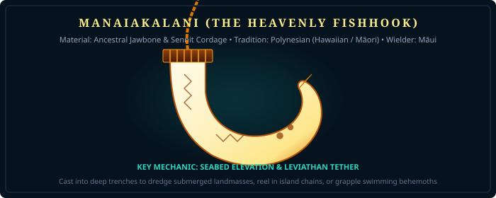

# Reliquary Spec: Sacred Tools & Navigational Implements

> *"Before warriors waged war across the oceans, the primordial architects used sacred instruments to dredge the islands from the deep, churn the waters into dry land, and fold ships into their pouches."*

---

## 1. Manaiakalani (The Great Fishhook of Māui) — *Polynesian*

**Title:** The Hook that Drew Up the Earth  
**Primary Source:** Polynesian Oral Tradition (*He Kumulipo*, Hawaiian & Māori Chants)  
**Material:** Carved from the magical jawbone of Māui's ancestress *Muri-ranga-whenua*, bound with braided sennit (*aho*) woven from sacred coconut fibers.

---

---

### Mechanics & Gameplay Features
- **Seabed Dredging (Island Raising):** Cast from a ship or cliff into oceanic trenches. Reeling it in with cooperative party members dredges up submerged atolls, sunken galleys, and coral formations from the sea floor, creating permanent or temporary player landmasses.
- **Titan-Scale Grappling Hook:** Can latch onto colossal swimming leviathans (such as the Midgard Serpent or giant sperm whales) to ski across the water surface at 500% speed.
- **Celestial Navigation Tether:** When held aloft on a clear night, the shank aligns with the hook-shaped star cluster *Manaiakalani* (the constellation Scorpius), pointing true toward the nearest undiscovered island.

---

## 2. Amenonuhoko (天沼矛) — *Japanese / Shinto*

**Title:** The Heavenly Jeweled Spear of Genesis  
**Primary Source:** *Kojiki* (Chapter 3) & *Nihon Shoki*  
**Original Owners:** Izanagi-no-Mikoto & Izanami-no-Mikoto  
**Design:** A gilded naginata-style spear adorned with celestial magatama jewels.

### Mechanics & Gameplay Features
- **Ocean Churning & Terrain Solidification:** When lowered into open water and stirred, curdles the brine into solid salt-stone platforms that players can stand upon for 5 minutes (enabling foot armies to cross open water channels).
- **Water Purification:** Cleanses toxic red tides, poison river plumes, and necrotic waters within a 50-meter radius into pure drinking water.
- **Geological Compass:** Vibrates when held over subterranean gold, jade, or orichalcum deposits beneath the seabed.

---

## 3. Skíðblaðnir (The Foldable Ship) — *Norse*

**Title:** The Ship of Favorable Winds  
**Primary Source:** *Gylfaginning* (Chapter 43) & *Ynglinga Saga*  
**Forge:** Built by the Sons of Ivaldi for the Vanir god Freyr.  
**Material:** Mythic ash wood planks and silk cordage.

### Mechanics & Gameplay Features
- **Pocket Folding:** Can carry an entire player party (up to 40 players) across the open sea. When not in use, the ship folds down into a compact cloth parcel that fits inside a player's inventory bag.
- **Perpetual Fair Wind:** Whichever direction the ship turns, a favorable gale immediately springs up behind its sails (*Bör-vinda*), guaranteeing maximum sailing speed regardless of weather systems.
- **Amphibious Gliding:** Can sail across water, ice floes, and frozen tundra with equal ease.

---

## 4. The Iron Fan (Bashōsen / 芭蕉扇) — *Chinese / Taoist*

**Title:** The Plantain Fan of Wind & Rain  
**Primary Source:** *Journey to the West* (西遊記), Chapters 59–61  
**Original Owner:** Princess Iron Fan (Tieshan Gongzhu) / Lord Laozi (Taishang Laojun)

### Mechanics & Gameplay Features
- **Inferno Extinguisher:** One wave dims raging wildfires; two waves summon cool rain; forty-nine waves extinguish mountains of volcanic fire (such as Mount Huoyan) permanently.
- **Typhoon Propulsion:** Aimed at the sails of a ship or behind a flying player to create a massive wind-tunnel gale that catapults vessels across oceanic leagues.
- **Gale Hurling:** Enemies caught in the fan's cone are swept up into tornado whirlwinds and thrown 100 meters backward without sustaining falling damage.

---

## 5. The Cauldron of the Dagda (The Undry) — *Celtic / Irish*

**Title:** The Cauldron of Plentiful Sustenance (*Coire Ansic*)  
**Primary Source:** *The Four Treasures of the Tuatha Dé Danann* (Lebor Gabála Érenn)  
**Origin:** Brought from the mythical city of *Murias* in the northern islands.

### Mechanics & Gameplay Features
- **The Inexhaustible Banquet:** Once per day, provides high-tier nutritional feasts for up to 100 players, boosting max health, stamina regeneration, and plague resistance.
- **Universal Panacea Brewing:** The sole cauldron in the world capable of brewing the antidote for high-tier realm plagues (e.g. *The Scourge of Niflheim* or *The Venom of Apep*).
- **Resurrection Bath:** Wounded or fallen allies placed inside the cauldron regenerate health to full over 30 seconds.

---

## 6. The Sekhem & Was Scepters — *Egyptian*

**Title:** The Staffs of Authority and Primordial Order (*Ma'at*)  
**Primary Source:** *Pyramid Texts* & Relics of the Pharaohs and Gods (Ptah, Osiris, Anubis)  
**Design:** 
- *Was-Scepter:* A straight staff crowned by the head of the Set-animal, terminating in a forked tail.
- *Sekhem:* A flat ritual paddle symbolizing divine capability and cosmic authority.

### Mechanics & Gameplay Features
- **Order Over Chaos (Anti-Isfet):** Emits an aura of divine law that calms berserk sandstorms, dispels chaotic hallucinations, and causes rogue underworld spirits to bow in submission.
- **Pylon Key:** The only implements capable of opening the 12 Gates of the Hour in the Egyptian underworld and unlocking sealed sandstone tomb chambers.
- **Spirit Pacification:** Instantly disables curses placed on looted sarcophagus treasures.

---

## 7. Qiankun Dai (乾坤袋) — *Chinese / Taoist*

**Title:** The Heaven-and-Earth Universe Pouch  
**Primary Source:** *Investiture of the Gods* (Fengshen Yanyi) & Taoist Relic Lore  
**Original Owner:** Maitreya Buddha / Taoist Immortals

### Mechanics & Gameplay Features
- **Infinite Pocket Spatial Storage:** Contains an entire pocket dimension inside a small silk drawstring purse. Can swallow and store hundreds of resource crates, building stones, or tamed wildlife without encumbering the player.
- **Projectile Vortex:** Opened toward incoming arrow swarms or siege stones to suck them harmlessly into the bag.
