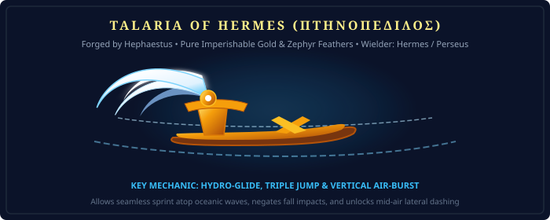

# Reliquary Spec: Relics, Regalia & Wearable Artifacts

> *"The armor of heroes defends the flesh; the regalia of gods defends the soul and bends the laws of motion, visibility, and gold to its wearer's will."*

---

## 1. Talaria of Hermes (Πτηνοπέδιλος) — *Greek / Hellenic*

**Title:** The Golden Winged Sandals of the Messenger  
**Primary Source:** *Homer's Odyssey*, *Hesiod's Shield of Heracles*, *Apollodorus' Bibliotheca*  
**Forge:** Forged by Hephaestus from imperishable celestial gold and the feathers of the four winds.  
**Wearer:** Hermes / Borrowed by Perseus to slay Medusa.

---

---

### Mechanics & Gameplay Features
- **Hydro-Glide (Ocean Water Sprint):** Allows the wearer to sprint across the open ocean surface without sinking, moving at double standard sprint speed.
- **Vertical Air-Burst & Triple Jump:** Grants two additional mid-air jumps with golden feather particle explosions, followed by a sustained horizontal glide.
- **Fall-Impact Negation:** Completely removes falling damage from any height; the wearer drifts to earth like a falling feather.
- **Integration with Current Prototype:** Provides the mythological justification for the toggleable `Flight` ability in `src/character/abilities/Flight.ts`.

---

## 2. Aegis of Athena & Zeus (Αἰγίς) — *Greek / Hellenic*

**Title:** The Gorgon-Crowned Terror Breastplate / Shield  
**Primary Source:** *Homer's Iliad* (Book V) & *Theogony*  
**Material:** The skin of the divine goat Amalthea, bordered by a hundred golden tassels, inlaid with the severed head of the Gorgon Medusa.

### Mechanics & Gameplay Features
- **The Gorgon's Dread (Aura of Terror):** When brandished, unleashes a petrifying flash that freezes advancing enemy infantry in their tracks and causes mounts to rear in blind panic.
- **Petrification Immunity:** Grants the wearer total immunity to petrifying gaze attacks (such as Basilisk or Medusa gaze).
- **Thunderbolt Deflection:** Projectiles and elemental spell bolts fired directly at the Aegis are reflected back toward the caster at 150% velocity.

---

## 3. Cap of Hades / Helm of Darkness (Ἄϊδος κυνέη) — *Greek / Hellenic*

**Title:** The Dog-Skin Helm of the Unseen  
**Primary Source:** *Apollodorus' Bibliotheca*, *Hesiod's Shield of Heracles*  
**Forge:** Crafted by the elder Cyclopes (Brontes, Steropes, Arges) during the Titanomachy.  
**Wearers:** Hades / Hermes / Perseus / Athena.

### Mechanics & Gameplay Features
- **Absolute Invisibility:** Grants complete invisibility that cannot be detected by standard mortal sight, thermal vision, or monster smell. The wearer casts no shadow and leaves no footprints in sand or snow.
- **Auditory Dampening:** Muffles footstep sounds and metal armor clinking to absolute zero decibels.
- **Underworld Passage:** Allows the wearer to walk freely among hostile undead and shade spirits without drawing aggression.

---

## 4. Draupnir (The Golden Dropper) — *Norse*

**Title:** The Ring of Replicating Gold  
**Primary Source:** *Skáldskaparmál* (Prose Edda) & *Gylfaginning*  
**Forge:** Brokkr and Sindri's dwarven forge in Svartálfaheimr.  
**Original Owner:** Odin the Allfather.

### Mechanics & Gameplay Features
- **The Ninth Night Replicate:** Every nine in-game days, the ring drips eight identical gold armbands of equal weight and value, generating passive sovereign currency for the wearer or their guild treasury.
- **Economic Fealty & Tribute:** Presenting a Draupnir armband to local chieftains or merchants unlocks maximum faction discount tiers and diplomatic alliances.

---

## 5. Oshun's Brass Mirror & Peacock Fan — *Yoruba / West African*

**Title:** The Looking-Glass of Sweet Waters and Truth  
**Primary Source:** *Ifá Corpus* (Odu Oshun) & Yoruba Oral Traditions  
**Original Owner:** Oshun (Ọṣun), Orisha of sweet waters, fertility, beauty, and diplomacy.

### Mechanics & Gameplay Features
- **Illusion Piercing:** Looking through the mirror reveals disguised shape-shifters, phantom islands (such as the true coastline of Hy-Brasil), hidden treasure barrows, and invisible spirits.
- **Charm of Sweet Waters:** Equipping the mirror and peacock fan placates hostile marine creatures (sharks, water serpents, kelpies), turning them into docile swimming companions.
- **Mirror Deflection:** Reflects psychic attacks, visual hypnosis, and siren songs back onto the attacker.

---

## 6. Brísingamen (The Flaming Amber Torc) — *Norse*

**Title:** The Glowing Necklace of the Vanir Maiden  
**Primary Source:** *Sörla þáttr* & *Poetic Edda*  
**Forge:** Crafted by the four dwarf smiths Alfrigg, Berling, Dvalinn, and Grerr.  
**Original Owner:** Freya, goddess of love, fertility, gold, and seiðr magic.

### Mechanics & Gameplay Features
- **Thermal Radiance:** Emits a soothing ambient warmth that completely negates freezing debuffs and hypothermia within a 15-meter party aura in polar zones (such as Niflheim).
- **Charisma & Diplomatic Sway:** Enhances trading prices with all global merchants by 25% and unlocks hidden dialogue options with stubborn mythological monarchs.
- **Seiðr Resonance:** Boosts the potency of nature and transformation spells by 30%.

---

## 7. The Cornucopia (Horn of Amalthea) — *Greek / Roman*

**Title:** The Horn of Plentiful Abundance  
**Primary Source:** *Ovid's Metamorphoses* (Book IX) & *Fasti*  
**Origin:** The severed horn of the divine goat Amalthea who suckled infant Zeus on Crete, filled by the nymphs with fresh fruits and ambrosia.

### Mechanics & Gameplay Features
- **Endless Provisions:** Can be activated once every hour to dispense baskets of divine ambrosia, figs, pomegranates, and honeyed cakes that provide party-wide stamina and health restoration.
- **Agricultural Fertility Aura:** When placed in a guild territory or settlement island, increases crop growth speed by 200% and attracts rare wildlife.
